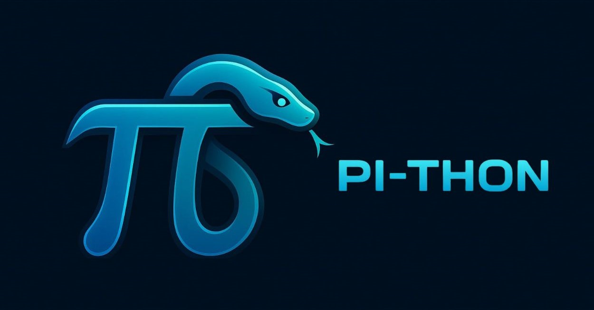

<p align="center">
  
</p>


# Projet PI-THON

## 📖 Table des matières

- [Présentation](#présentation)
- [Objectifs](#objectifs)
- [Installation](#installation)
- [Méthodes d'estimation](#méthodes-destimation)
- [Sauvegarde des résultats](#sauvegarde-des-résultats)
- [Technologies utilisées](#technologies-utilisées)
- [Documentation](#documentation)
- [Licence](#licence)
- [Auteurs](#auteurs)


## Présentation

**PI-THON** est un projet permettant d'estimer la valeur de **π** en python en utilisant plusieurs méthodes mathématiques et algorithmiques. L'objectif est de comparer ces méthodes en termes de **vitesse, précision et convergence**, tout en proposant une **visualisation interactive** avec **Pygame**.

Ce projet a été réalisé dans le cadre des **Trophées NSI 2025**.

---
## Objectifs 

L'objectif de **π -THON** est de fournir une plateforme interactive permettant :

#### 1️⃣ L'exploration mathématique

- Visualiser différentes méthodes d'estimation de π, allant des approches stochastiques (ex. Monte-Carlo, Buffon) aux algorithmes haute précision (ex. Chudnovsky, Gauss-Legendre).
- Comprendre comment chaque méthode converge vers la valeur réelle de π.

#### 2️⃣ La comparaison des performances

- Observer les différences de vitesse de calcul et de précision entre les méthodes.
- Identifier lesquelles sont adaptées à un grand nombre de décimales et lesquelles sont plus adaptées à des expériences empiriques.

#### 3️⃣ Une approche pédagogique

- Faciliter la compréhension des concepts mathématiques derrière π.
- Montrer les liens entre mathématiques, physique et probabilités dans le calcul de π.

#### 4️⃣ Une interactivité renforcée

- L'utilisateur peut ajuster certains paramètres (ex. nombre d'itérations, vitesse de simulation).
- Une interface graphique avec Pygame permet de visualiser chaque méthode en action.

Enfin, ce programme peut s'avérer utile en tant que générateur de fichiers textes jusqu'à 300 millions de décimales contenant un nombre de décimales souhaité. (utile par exemple pour des applications scientifiques ou cryptographiques)

---

## Installation

### Installation des dépendances

Assurez-vous d'avoir **Python 3.10+** installé.  
Puis, installez les bibliothèques nécessaires avec :

```bash
pip install -r requirements.txt
```

### Lancer le programme

Avant toute chose, nous vous conseillons d'utiliser une résolution d'écran de 1920 x 1080 dans l'idéal, ou supérieure (ratio 16:9) (La résolution 2560 x 1440 a été testée sans problème, mais la résolution 1280 x 720 présentait des bugs d'affichage, bien que fonctionnelle.) <font color="red">afin d'éviter tout bug d'affichage.</font>

Si cela n'est pas possible, nous vous conseillons de cliquer sur le bouton de plein écran ou d'appuyer sur la touche f ou f11 à l'entrée dans l'application pour utiliser le mode fenêtré. <font color="red">Nous ne garantissons pas un affichage sans bugs pour d'autres résolutions.</font>

- Depuis le répertoire racine du projet, exécutez :

```bash
python sources/main.py
```

---

## Méthodes d'estimation

| Méthode                 | Principe                                      |
| ----------------------- | --------------------------------------------- |
| Monte-Carlo             | Simulation aléatoire de points dans un cercle |
| Buffon                  | Lancer d’aiguilles sur un sol en lattes       |
| Archimède               | Encadrement du cercle par des polygones       |
| Leibniz                 | Série alternée (1 - 1/3 + 1/5 - ...)          |
| Nilakantha              | Amélioration de Leibniz                       |
| Machin                  | Formule basée sur l'arctangente               |
| Gauss-Legendre          | Algorithme rapide pour haute précision        |
| Borwein                 | Convergence exponentielle                     |
| Chudnovsky              | Utilisé pour les records de décimales         |
| Ramanujan               | Formule rapide basée sur les factorielles     |
| Pendule                 | Estimation basée sur la physique du pendule   |
| Collisions              | Expérience physique des collisions élastiques |
| Approximation intégrale | Estimation via l’aire sous une courbe         |

---

## Sauvegarde des résultats

Les résultats générés sont enregistrés dans `data/resultats_estimations_pi/` sous forme de fichiers `.txt` :

```
data/pi_estimations/pi_gauss-legendre_mille.txt
data/pi_estimations/pi_borwein_5_million(s).txt
```

Chaque fichier contient :

1. **La méthode utilisée**.
2. **Le nombre de décimales calculées**.
3. **Le temps de calcul**.
4. **Le résultat de l'estimation**.
5. **Une vérification avec les décimales de référence**.

---

## Technologies utilisées

Le projet **PI-THON** repose sur les bibliothèques suivantes pour l'affichage interactif et les calculs haute précision :

| Technologie | Description |
|------------|------------|
| **Python 3.10+** | Langage principal du projet, utilisé pour implémenter les méthodes d'estimation de π. |
| **Pygame** | Bibliothèque permettant de gérer l'affichage et l'interactivité avec l'utilisateur. |
| **pygame-textinput** | Extension de Pygame permettant la saisie de texte dans l'interface utilisateur. |
| **gmpy2** | Bibliothèque optimisée pour les calculs haute précision, utilisée notamment dans les algorithmes comme Gauss-Legendre, Chudnovsky et Borwein. |

#### 📌 Pourquoi ces technologies ?

- **Pygame** permet de visualiser en temps réel les méthodes d’estimation de π et d’interagir avec l’interface.  
- **pygame-textinput** améliore l’expérience utilisateur en ajoutant la possibilité d’entrer des valeurs.  
- **gmpy2** optimise les calculs nécessitant une grande précision, ce qui est essentiel pour certaines méthodes avancées, et il permet des calculs beaucoup plus rapides.
    -  Par exemple, **Python natif et le module `math` arrondissent les valeurs**, ce qui empêche d’atteindre une grande précision dans les calculs. Avec `gmpy2`, on évite ces limitations en utilisant une précision arbitraire et on peut travailler avec un très grand nombre de décimales sans perte de précision.  

---

## Documentation

- [Structure du projet](docs/structure_du_projet.md)

---

## Licence

Ce projet est sous licence **GPL v3+**. Vous pouvez l’utiliser, le modifier et le distribuer librement tant que vous respectez cette licence.

---

## Auteurs

- Arthur Jeaugey || jeaugeyarthur@gmail.com || Instagram [para.bellum._](https://www.instagram.com/para.bellum._/)
- Paul Chevasson
- Samuel Mopty
