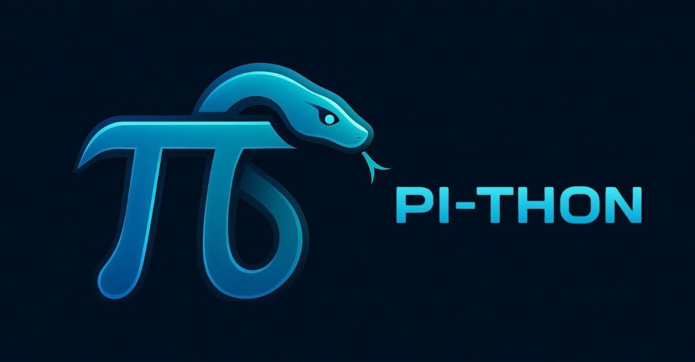

<p align="center">
  <a href="https://tube-sciences-technologies.apps.education.fr/w/iGFmQFagKMJLAVNoa2pEtf"></a>
  <h3 align="center">⬆️⬆️⬆️<br><br>CLICK ON THE LOGO TO WATCH THE VIDEO</h3>
</p>

## 📖 Table of Contents

- [Introduction](#introduction)
- [Goals](#goals)
- [Installation](#installation)
- [Estimation Methods](#estimation-methods)
- [Saving Results](#saving-results)
- [Technologies Used](#technologies-used)
- [Documentation](#documentation)
- [License](#license)
- [Authors](#authors)

## Introduction

**PI-THON** is a project to estimate the value of **π** in Python using multiple mathematical and algorithmic methods. The goal is to compare these methods in terms of **speed, precision, and convergence**, while offering an **interactive visualization** with **Pygame**.

This project was developed as part of the "**Trophées NSI 2025**".

---
## Goals

The goal of **PI-THON** is to provide an interactive platform that allows:

#### 1️⃣ Mathematical exploration

- Visualize different methods for estimating π, from stochastic approaches (e.g., Monte Carlo, Buffon) to high-precision algorithms (e.g., Chudnovsky, Gauss-Legendre).
- Understand how each method converges toward the true value of π.

#### 2️⃣ Performance comparison

- Observe differences in computation speed and precision across methods.
- Identify which are suitable for high decimal calculations and which are better for empirical experiments.

#### 3️⃣ Educational approach

- Help understand the mathematical concepts behind π.
- Show links between math, physics, and probability in π calculations.

#### 4️⃣ Enhanced interactivity

- Users can adjust certain parameters (e.g., number of iterations, simulation speed).
- A graphical interface with Pygame allows visualizing each method in action.

Finally, the program can also be used as a text file generator with up to 300 million decimals (useful for scientific or cryptographic applications).

---
## Installation

### Installing dependencies

Make sure you have **Python 3.10+** installed.  
Then, install the required libraries with:

```bash
pip install -r requirements.txt
```

### Running the program

Ideally, use a screen resolution of 1920 x 1080 or higher (16:9 ratio). (2560 x 1440 was tested without issue; 1280 x 720 showed display bugs, though still functional.) <font color="red">to avoid display issues.</font>

If this isn't possible, click the fullscreen button or press `f` or `f11` when entering the app to use windowed mode. <font color="red">We can't guarantee bug-free display at other resolutions.</font>

- From the project's root directory, run:

```bash
python sources/main.py
```

---
## Estimation Methods

| Method                 | Principle                                      |
| ---------------------- | --------------------------------------------- |
| Monte Carlo           | Random simulation of points inside a circle    |
| Buffon               | Needle-throwing experiment on lined floor       |
| Archimedes           | Circle bounded by polygons                     |
| Leibniz             | Alternating series (1 - 1/3 + 1/5 - ...)       |
| Nilakantha         | Improved Leibniz series                          |
| Machin               | Formula based on arctangent                    |
| Gauss-Legendre  | Fast high-precision algorithm                      |
| Borwein            | Exponential convergence                         |
| Chudnovsky       | Used for decimal record computations             |
| Ramanujan         | Fast factorial-based formula                     |
| Pendulum          | Physics-based estimation with pendulum motion    |
| Collisions          | Elastic collision experiment                   |
| Integral Approximation | Estimation via area under a curve             |

---
## Saving Results

Generated results are saved in `data/resultats_estimations_pi/` as `.txt` files:

```
data/pi_estimations/pi_gauss-legendre_thousand.txt
data/pi_estimations/pi_borwein_5_million(s).txt
```

Each file contains:

1. **Method used**.
2. **Number of decimals computed**.
3. **Computation time**.
4. **Estimation result**.
5. **Reference decimal check**.

---
## Technologies Used

The **PI-THON** project uses the following libraries for interactive display and high-precision calculations:

| Technology        | Description |
|-------------------|-------------|
| **Python 3.10+** | Main project language, implementing π estimation methods. |
| **Pygame**       | Library for display and user interaction. |
| **pygame-textinput** | Pygame extension for text input in the UI. |
| **gmpy2**        | Optimized library for high-precision calculations, used in algorithms like Gauss-Legendre, Chudnovsky, and Borwein. |

#### 📌 Why these technologies?

- **Pygame** enables real-time visualization of π estimation methods and interaction.  
- **pygame-textinput** improves UX by adding input features.  
- **gmpy2** optimizes calculations needing high precision, essential for advanced methods, and avoids native Python/math module rounding issues by using arbitrary precision — crucial for working with millions of decimals without precision loss.

---
## Documentation

- [Project structure](docs/structure_du_projet.md)

---
## License

This project is under the **GPL v3+** license. You are free to use, modify, and distribute it as long as you comply with the license terms.

---
## Authors

- Arthur Jeaugey || jeaugeyarthur@gmail.com || Instagram [para.bellum._](https://www.instagram.com/para.bellum._/)
- Paul Chevasson
- Samuel Mopty
